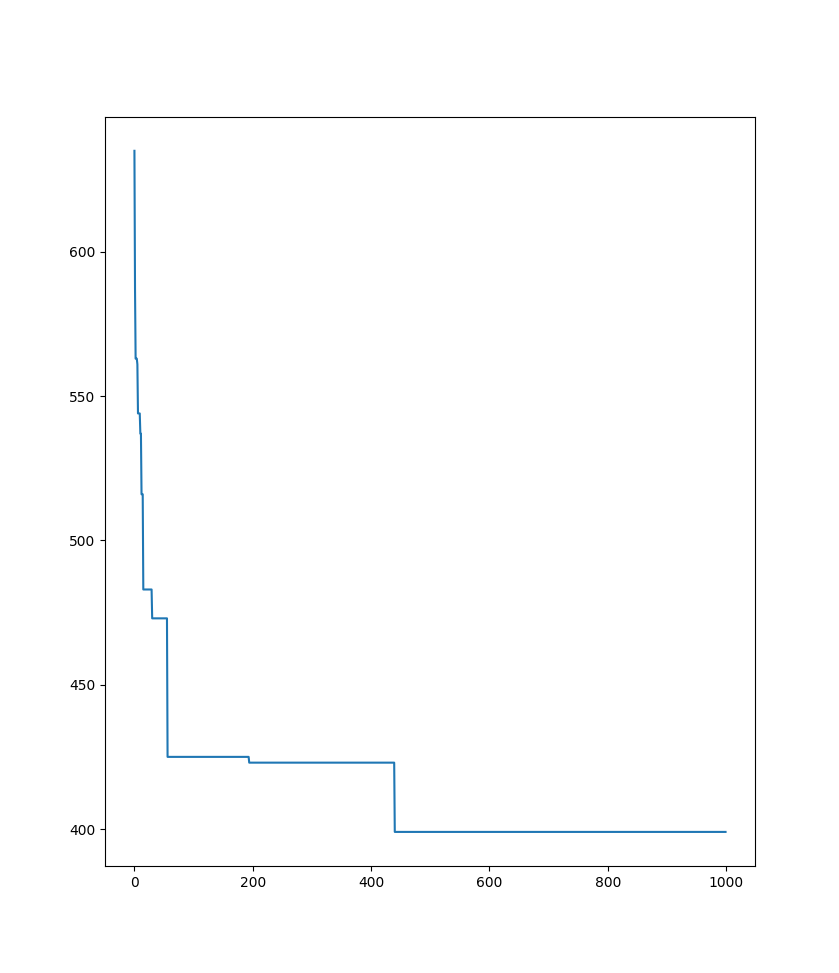
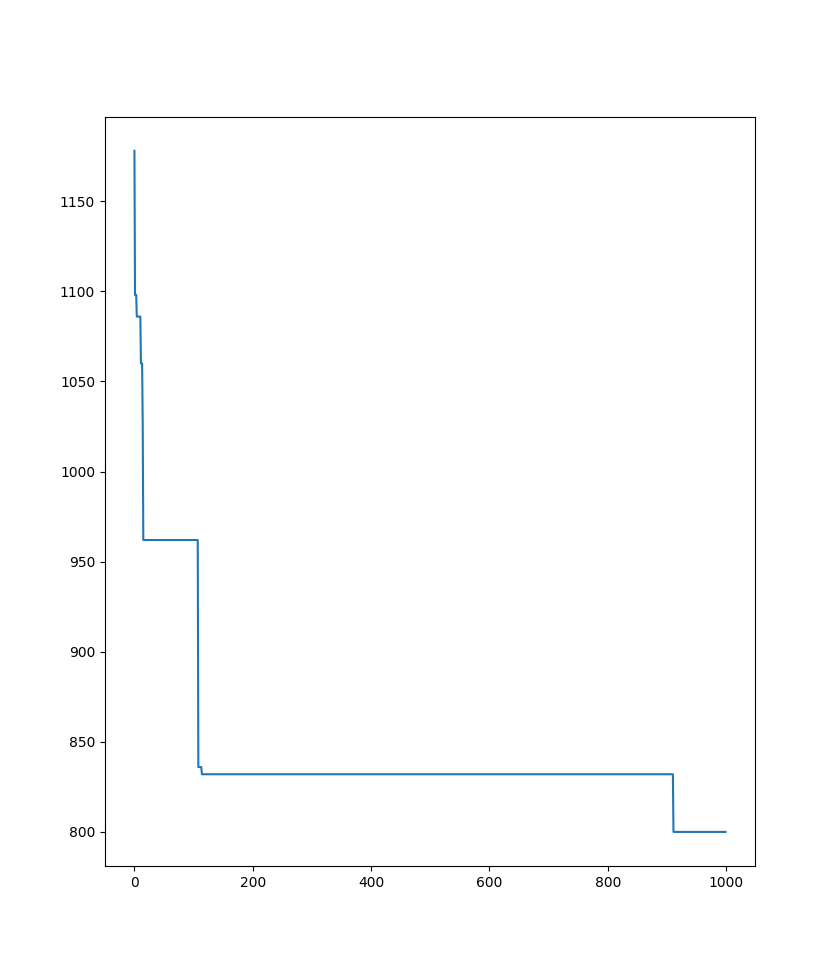

# CSO for OSSP

Cat Swarm Optimization algorithm for Open Shop Scheduling Problem

Based on https://link.springer.com/article/10.1007/s40092-018-0297-z#Sec2

* `times.csv` includes times required to execute operations
* `machines.csv` includes machines on which operations must be executed
* each row represents a job
* each column represents an operation

### TODO
* fix calculating fitness
* implement tracing mode
* select cat position in seeking mode by probability

### Results

#### Parameters

* SMP = 5
* SRD = 2
* CDC = 10
* SPC = True
* MR = 0.30
* cats num = 50
* iterations = 1000

For `times.csv` and `machines.csv` included in this repository

For 2 * `times.csv` and `machines.csv` included in this repository

